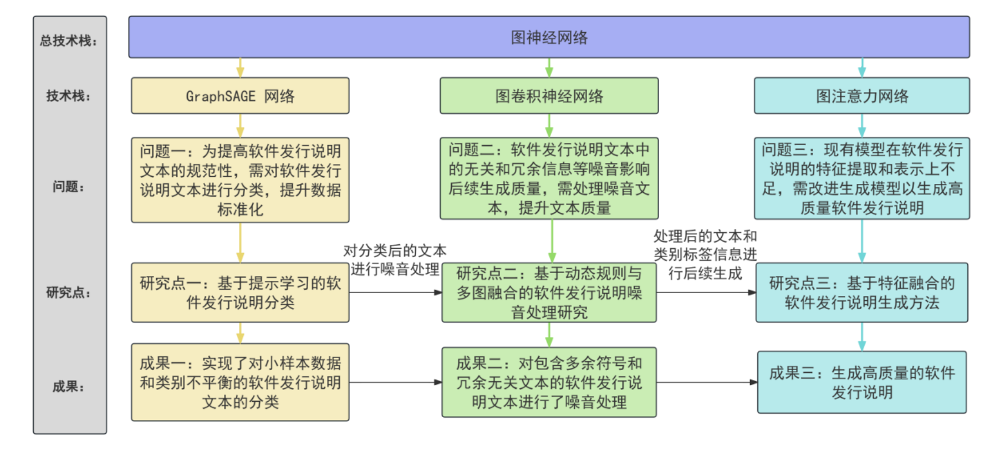
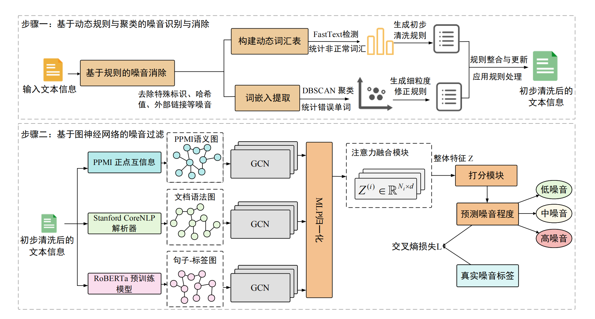
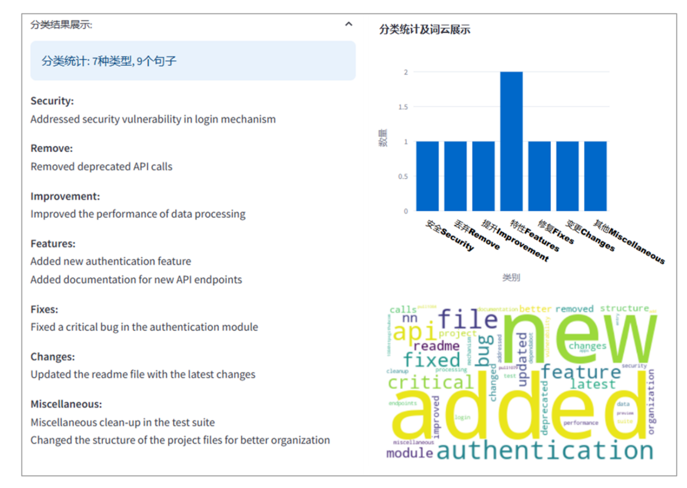
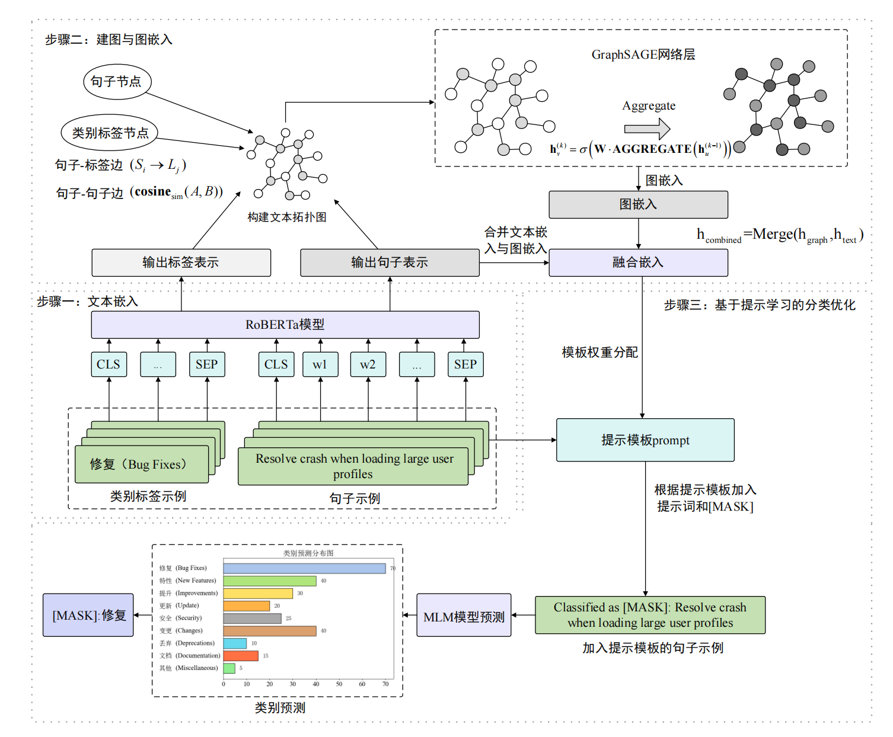
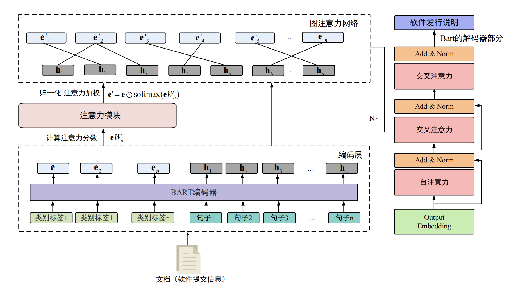
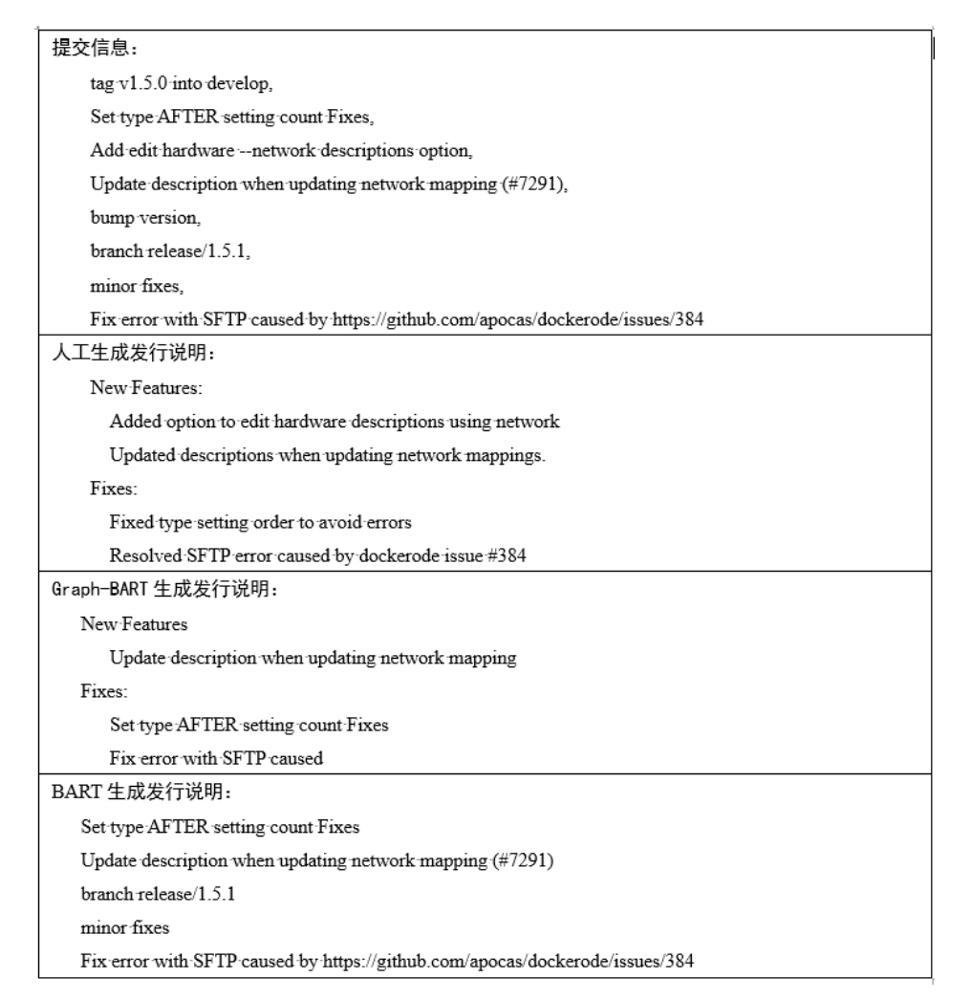
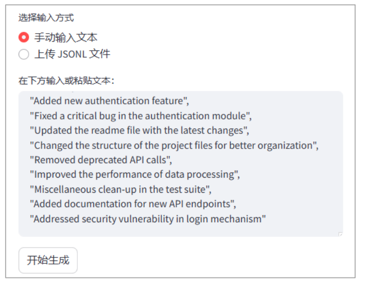

# Paper-Project

This repository contains the code and supporting assets for my thesis project on software release note generation and classification.

## 项目简介

本项目围绕软件发行说明的生成、分类与噪音处理展开，结合图结构建模、提示学习与多模块融合方法，完成发行说明数据处理、建模训练与结果展示。

## Overall Architecture

## Core Modules

### Noise Processing Model

### Classification Module

### Prompt Learning Classifier

### Graph-BART Generation Model

## Generation Comparison

## User Input Demo

## Directory Layout

- `main/`: main code for generation, classification, and data processing
- `cnn_baseline/`: baseline model scripts
- `bart-base/`, `bart-large/`, `bert-base-uncased/`: local model resources
- `test_rouge/`: evaluation utilities
- `assets/images/`: thesis figures used in this README

## Notes

- Images are stored under `assets/images/` with short English filenames for stable Markdown links.
- This repository currently focuses on project code and presentation assets.
